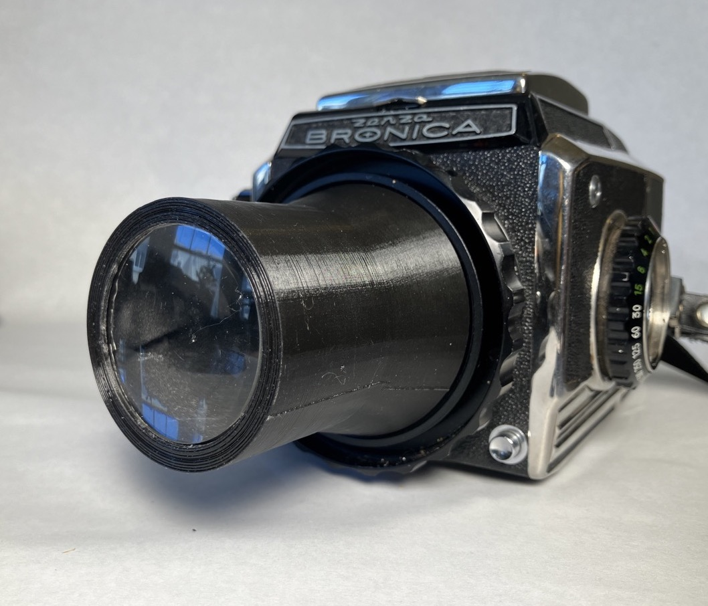
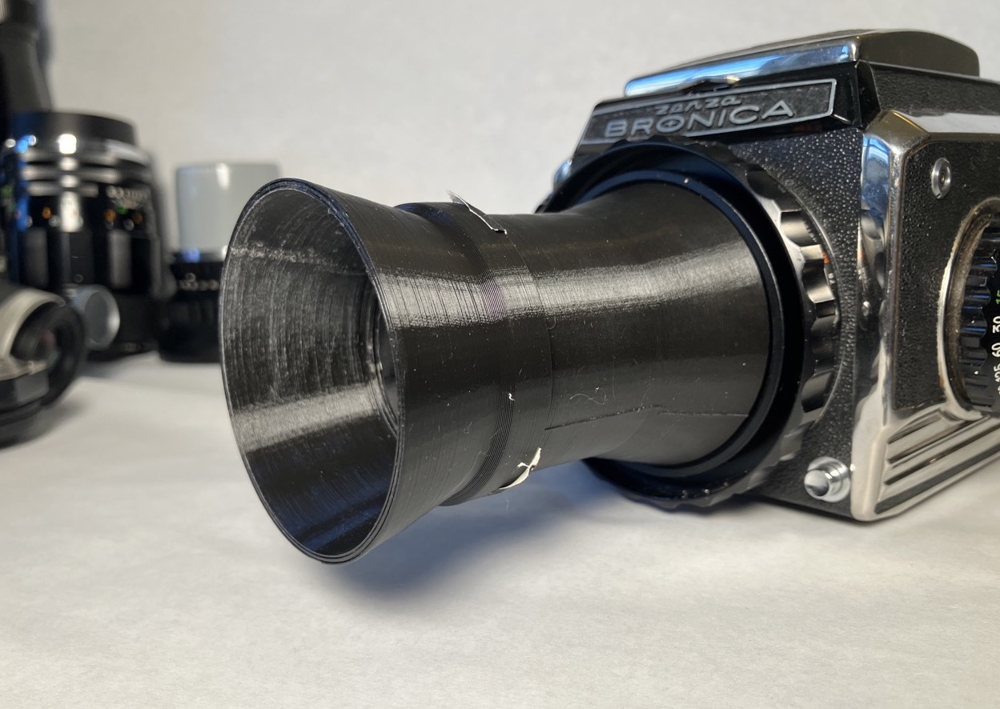
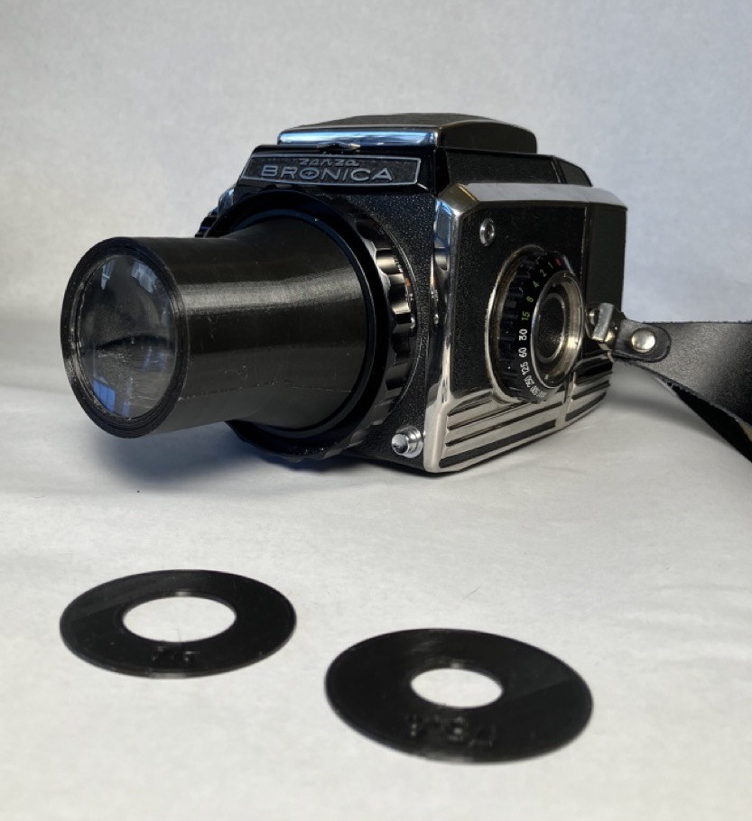
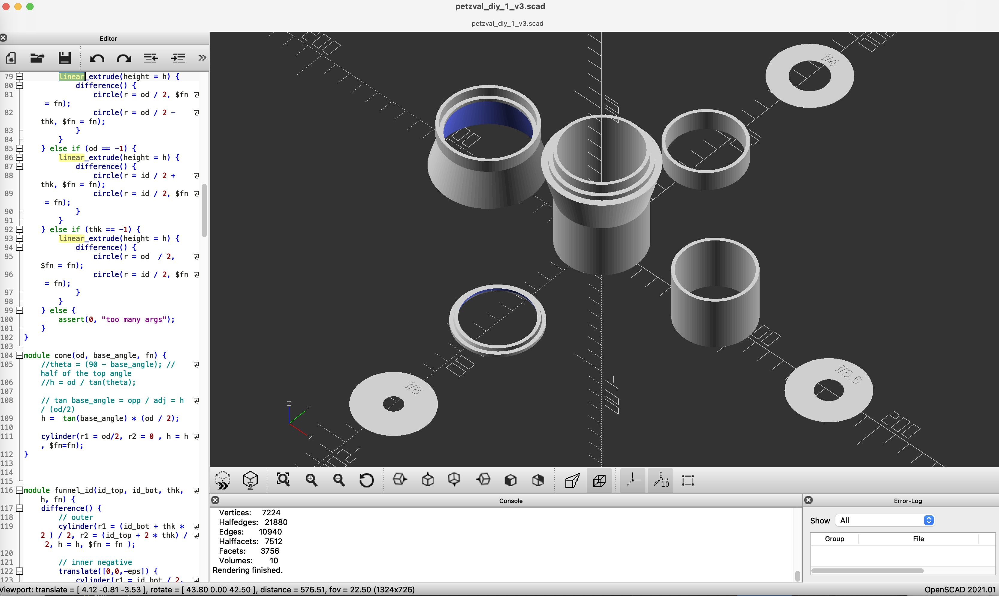
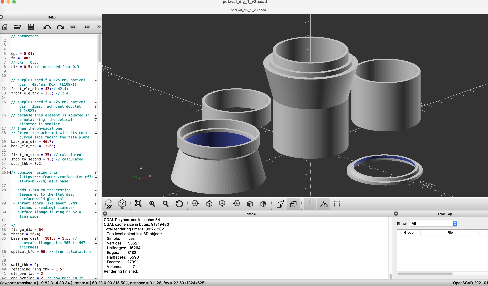
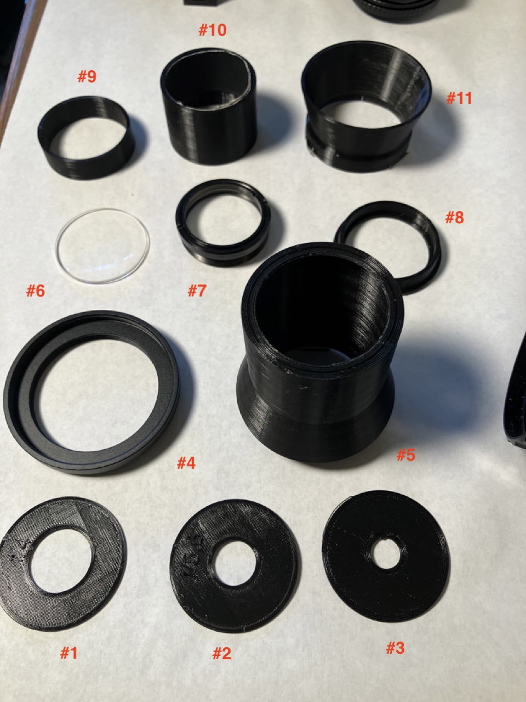

## My first attempt at designing and building a lens from scratch

For quite some time, I've wanted a petzval-like lens for my Bronica S2a.  More specifically, I want a lens that is reasonably fast, delivers swirly bokeh, and has field curvature like a bowl.  And cost less than $500.

I tried buying a cheap brass petzval, but it turned out to be way too big (I have future plans for this one).  I struggle with figuring out the right focal length to clear the flange distance with these petzval and magic lantern type lenses.....

I have also tried adapting existing lenses, like the [simple lens from a Buster Brown 3A box camera](https://www.reddit.com/r/AnalogCommunity/comments/1iykq9i/bronica_s2a_sporting_a_box_camera_lens_with_a/), but this didn't delivery.

So onto designing my own lens.

I've been going down the optics rabbit hole for a few months (some good resources below at the end), so I have a basic grasp of the simple lens design options (single, doublet/achromat, triplet, tessar, etc).

I figured that I'd try for a sort of doublet / petzval-ish design:  a simple biconvex front element and a cemented achromatic rear doublet, with a stop between.   I worked out the math using the thin lens formula ( 1/f = 1/f1 + 1/f2 + 1/f1f2 ) and the back focus distance formula ( BFD = (f2(f1-d))/(f1+f2-d) ) to make sure it would fit the Bronica.  

I bought a half dozen different lens elements that would give me some options to work with from [SurplusShed using their lensfinder](https://www.surplusshed.com/search_lenses.php).  Most are about $5-10.

For the lens housing, after messing around with trying to find pipes or tubes that would nest at my local hardware store, I bit the bullet and decided to design it in CAD and 3d print it.  I'd bought a 3d printer about 7 years ago, but the first time I'd tried to use it I couldn't get the bed leveling right and managed to partially break it.  Using knowledge and skills gained in the intervening years, I replaced the messed up hot end, cleaned and regreased the screws, blew the power supply, and replaced that too.  

With a now working printer, I started [designing the lens in openscad](https://github.com/brianssparetime/bronica_petzval_1).  I've only played with openscad a few times (mainly updating a design for KMZ FT2 film carts), but it's very straight forward for someone with a programming background, and simple to learn.

Unfortunately, I was playing around with my lens design spreadsheet when I was doing the cad design, and wound up using the wrong set of lens elements in my design, so the resulting back focal distance is much more suited to a 35mm SLR than my Bronica.

Although I failed in my main objective (pun intended), I learned a lot from this first go and I'm not done with this idea yet.  I need to double check my math, but I think the outline of the optical design has some promise and might be interesting to others (given its suitability for 35mm).  I think the design came out well aesthetically.

Any advice welcomed!   

Also, credit where credit is due - I was inspired in part by reddit.com/u/TheAlbinoGiraffe.   When you posted your 35mm perf machine, I checked out the rest of your site and saw your [post about designing a multi-element lens](https://www.jacksonbohm.com/read/designing-and-3d-printing-a-multi-element-portrait-lens).  I'm not where you are with ray tracing, but I figured a shittier version was within my reach.   

Finally, disclaimer:   I did experiment a bit with AI on this project.  I used chatgpt 4o at several points to confirm and explore aspects of what I was considering.   On optical engineering, I found it sucked (bad math, some lying, made up element recommendations).   On generating openscad, I found it sucked (generated code didn't run, wasn't accurate to descriptions).   But it damn sure was good at fixing my 3d printer and printing issues, except for lying to me about the its recommended replacement PS having a matching screw pattern.  So the openscad is my own code and the optical failures are my fault too.

The parts of the lens from the image with the red numbers:

1) f4 stop disc
2) f5.6 stop disc
3) f8 stop disc

4) [RAF Camera male M57 to female M65 adapter](https://rafcamera.com/adapter-m65x1f-to-m57x1m)
5) the main barrel of the lens housing.   this has a retaining ring on the front to keep the front element in place, and geometry on the bottom to mate with the RAF camera adapter

6) doubleconvex front element, fl about 125mm, diameter about 42mm
7) achromat rear element, came housed, fl about 125mm, diameter about 44mm
8) rear retaining ring, which pressed into the back of the main barrel to keep the everything in place

9) back spacer
10) front spacer
11) lens hood

Basically, everything stacks into the main barrel.  In order:  front element, front spacer, stop disc, back spacer, rear element, retaining ring.

Lens design resources:

 - [LensRentalBlog](https://www.lensrentals.com/blog/2011/08/lens-geneology-part-1) great for learning about basic designs without a ton of math (singlet, doublet, triplet, tessar, tele/retro, double gauss)
 - [PencilOfRays](https://www.pencilofrays.com/lens-design-forms/) - this was interesting, but too advanced for me.  I didn't know a lot of the attributes of my budget lenses which I needed to fill out the spreadsheet
 - formulas for lens combination and bfd [here](https://jackwestin.com/resources/mcat-content/geometrical-optics/combination-of-lenses) and [here](https://physics.stackexchange.com/questions/800901/geometric-optics-multiple-lens-focal-length-calculation)
 - [lensmaker's equation on wikipedia](https://en.wikipedia.org/wiki/Lens#Lensmaker%27s_equation)

